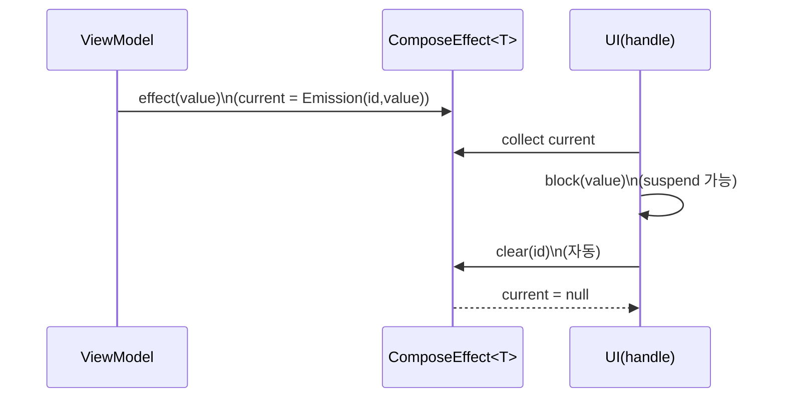
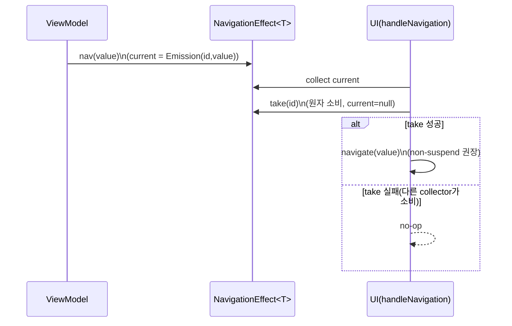

# ComposeEffect 및 NavigationEffect 기반 One-off UI Effect 처리 표준화 제안서

- 작성일: 2026-02-17  
- 대상: Android(Compose) 프로젝트 / ViewModel의 일회성 UI 동작(One-off UI Effect) 처리 표준화

> 목표: **StateFlow 기반 “상태로서의 단일 이벤트”** 패턴을 유지하면서, 화면/VM에서 반복되는 **초기화(clear/consume) 보일러플레이트를 공통화(자동화)** 한다.  
> 본 표준안은 **각 Effect 타입별로 “마지막 1건 보장(last-wins/coalesce)”** 을 기본 전제로 한다.  
> 동일 Effect에서 발생한 N건을 절대 누락 없이 FIFO로 보장해야 한다면, 별도 큐/Channel 계열 설계를 적용한다(본 문서 범위 밖).

---

## 요약

본 제안서는 ViewModel에서 발생하는 일회성 UI 동작(Toast/Snackbar/Haptic/Navigation 등)을 기존 SingleLiveEvent 및 flag/reset 패턴 대신, 경량 상태 홀더로 표준화하여 다음을 달성한다.

- ViewModel 발행 API를 단순화한다: `effect(value)` 혹은 `effect.call(value)`
- UI에서 “처리 후 초기화(clear)”를 공통 컴포저블에서 자동 수행한다: `effect.handle { ... }`
- Navigation은 메시지/햅틱과 성격이 다르므로 `NavigationEffect`로 분리하여 **중복 실행을 구조적으로 방지**하고, 일반 `handle` API에 취소 정책 파라미터(예: `clearOnCancel`)를 노출하지 않는다.

이 설계는 Android 아키텍처 문서가 설명하는 “UI에서 이벤트를 소비한 뒤 상태를 갱신한다” 흐름을 유지하면서도, 팀 코드베이스 전반의 보일러플레이트를 줄이고 정책을 일관되게 한다.

---

## 1. 배경과 문제 정의

ViewModel에서 발생하는 일회성 UI 동작은 상태(state)와 성격이 다르지만, Compose에서는 UI 레이어에서 side-effect API(예: `LaunchedEffect`)로 생명주기에 맞추어 실행하는 것이 자연스럽다. Android 아키텍처 가이드는 transient 메시지(예: Snackbar)를 UI state로 표현하고, UI가 메시지를 표시한 뒤 ViewModel에 알려 상태 업데이트(초기화)를 트리거하는 패턴을 설명한다. [1]

팀 내 논쟁의 핵심은 다음과 같다.

- SingleLiveEvent: 구현은 단순하지만, 재구독/경합/테스트 및 예측 가능성 관점에서 표준으로 두기 어렵다.
- flag/reset 방식: 화면마다 켜기/끄기 및 초기화 코드가 반복되어 보일러플레이트가 증가한다.
- Channel/SharedFlow: 전달/버퍼 정책에 따라 유실 또는 backpressure가 발생할 수 있으며, UI 생명주기와의 결합 규칙을 명확히 정해야 한다.

본 제안은 “모든 이벤트를 100% 큐잉하여 처리”보다, **StateFlow 기반의 단일 슬롯(last-wins) + 초기화 자동화**에 초점을 둔다. 단, Navigation은 중복 실행 비용이 크므로 별도 타입으로 분리한다.

---

## 2. 목표와 비목표

### 2.1 목표
- ViewModel에서 효과 발행 API를 한 줄로 단순화한다.
- UI에서 clear/consume 코드를 공통화하여 화면별 보일러플레이트를 제거한다.
- `repeatOnLifecycle` 재구독 환경에서, **clear 이전의 “현재 슬롯”은 유지되어 UI가 다시 처리할 수 있게 한다**(효과 타입별 정책에 따라).
- BaseViewModel 상속 없이 기존 프로젝트에 점진적으로 도입/철회 가능해야 한다.
- Navigation은 별도 `NavigationEffect`로 분리하여 **중복 실행을 구조적으로 억제**한다.

### 2.2 비목표
- 프로세스 종료(강제 종료/OS kill) 이후에도 이벤트가 복구되어야 하는 “업무 데이터 보장”은 다루지 않는다.
- 단일 effect에서 발생한 N개의 이벤트를 모두 보장하는 FIFO 처리(큐잉)는 기본 범위가 아니다. 필요 시 큐/Channel 기반 확장안을 별도 적용한다.

---

## 3. 표준 API 제안

본 표준은 **일반 UI 효과용 `ComposeEffect<T>`** 와 **Navigation 전용 `NavigationEffect<T>`** 를 구분한다.

### 3.1 ComposeEffect<T>
- 역할: “UI에서 한 번 실행되어야 하는 동작 요청”을 상태로 들고 있는 홀더(단일 슬롯)
- 외부 API:
  - 발행: `effect(value)` 또는 `effect.call(value)`
  - UI 처리: `effect.handle { ... }` (처리 완료 후 자동 clear)
- 내부 구현:
  - `StateFlow<Emission<T>?>` 단일 슬롯 유지
  - `id(UUID)` 기반 clear로 경합 안전성 확보(이전 emission 처리가 새 emission을 지우는 문제 방지)
- 기본 정책:
  - last-wins(coalesce)
  - **성공/에러 시 clear**, 취소(cancellation) 시 clear하지 않음(유실 감소 방향)

### 3.2 NavigationEffect<T>
- 역할: Navigation은 Lifecycle에 따른 cosume 누락으로 “중복 실행”이 치명적일 수 있으므로 별도 처리
- 외부 API:
  - 발행: `navEffect(value)` 또는 `navEffect.call(value)`
  - UI 처리: `navEffect.handleNavigation { ... }`
- 내부 구현:
  - 단일 슬롯 `StateFlow<Emission<T>?>`는 유지하되,
  - **`take(id)`(원자적 소비)로 실행 전 clear를 강제**하여 재구독/중복 collector에서의 중복 실행을 억제
- 기본 정책:
  - last-wins(coalesce)
  - consume-first(실행 전에 소비)
  - handler는 **non-suspend 권장**(가능한 동기적으로 실행)

---

## 4. 동작 개요

### 4.1 구조 흐름

```mermaid
flowchart LR
  VM[ViewModel] -- effect(value) --> CE[ComposeEffect<T>\n(StateFlow slot)]
  CE -- current(Emission<T>?) --> UI1[Composable\nhandle { ... }]
  UI1 -- side-effect --> SIDE1[Snackbar / Toast / Haptic / ...]
  UI1 -- clear(id)\n(자동) --> CE

  VM -- nav(value) --> NE[NavigationEffect<T>\n(StateFlow slot)]
  NE -- current(Emission<T>?) --> UI2[Composable\nhandleNavigation { ... }]
  UI2 -- take(id)\n(원자 소비) --> NE
  UI2 -- navigate --> SIDE2[NavController.navigate]
```

### 4.2 시퀀스: ComposeEffect(처리 후 clear)



### 4.3 시퀀스: NavigationEffect(실행 전 take)



---

## 5. 레퍼런스 구현 코드

### 5.1 공통 Emission 모델

```kotlin
import java.util.UUID

data class Emission<out T>(
    val id: UUID = UUID.randomUUID(),
    val value: T
)
```

---

### 5.2 ComposeEffect<T> 구현

```kotlin
import kotlinx.coroutines.flow.MutableStateFlow
import kotlinx.coroutines.flow.StateFlow
import kotlinx.coroutines.flow.asStateFlow
import kotlinx.coroutines.flow.update
import java.util.UUID

class ComposeEffect<T> {

    private val _current = MutableStateFlow<Emission<T>?>(null)
    val current: StateFlow<Emission<T>?> = _current.asStateFlow()

    /** 발행: 마지막 값이 최신 상태가 된다 (last-wins/coalesce) */
    operator fun invoke(value: T) {
        _current.value = Emission(value = value)
    }

    fun call(value: T) = invoke(value)

    /** "내가 처리한 emission"만 clear (경합 안전) */
    internal fun clear(id: UUID) {
        _current.update { cur -> if (cur?.id == id) null else cur }
    }
}

/** Unit 편의 호출 */
fun ComposeEffect<Unit>.call() = this(Unit)
```

#### id 체크가 필요한 이유
UI가 emission(A)을 처리하는 중에 ViewModel이 emission(B)을 발행할 수 있다. A 처리 완료 후 clear를 수행할 때, B를 실수로 지우면 안 된다. 따라서 `clear(id)`는 현재 슬롯의 id가 일치할 때만 초기화한다.

---

### 5.3 ComposeEffect<T>.handle 구현(처리 후 clear, 취소 시 no-clear)

```kotlin
import androidx.compose.runtime.Composable
import androidx.compose.runtime.LaunchedEffect
import androidx.compose.runtime.rememberUpdatedState
import androidx.lifecycle.Lifecycle
import androidx.lifecycle.compose.LocalLifecycleOwner
import androidx.lifecycle.repeatOnLifecycle
import kotlinx.coroutines.CancellationException
import kotlinx.coroutines.flow.filterNotNull

@Composable
fun <T> ComposeEffect<T>.handle(
    minActiveState: Lifecycle.State = Lifecycle.State.STARTED,
    onError: (Throwable, T) -> Unit = { _, _ -> },
    block: suspend (T) -> Unit
) {
    val lifecycleOwner = LocalLifecycleOwner.current
    val latestBlock = rememberUpdatedState(block)
    val latestOnError = rememberUpdatedState(onError)

    LaunchedEffect(this, lifecycleOwner) {
        lifecycleOwner.lifecycle.repeatOnLifecycle(minActiveState) {
            current
                .filterNotNull()
                .collect { emission ->
                    try {
                        latestBlock.value(emission.value)
                        clear(emission.id) // 성공 후 자동 clear
                    } catch (ce: CancellationException) {
                        // 취소 시 clear하지 않음: 재구독에서 재처리 가능(유실 감소 정책)
                        throw ce
                    } catch (t: Throwable) {
                        latestOnError.value(t, emission.value)
                        clear(emission.id) // 에러 시 파이프라인 막힘 방지
                    }
                }
        }
    }
}
```

---

### 5.4 NavigationEffect<T> 구현(take로 consume-first 강제)

중복 collector 또는 재구독 타이밍에서도 중복 실행을 억제하기 위해, 실행 전에 원자적으로 값을 “가져가며” 슬롯을 비우는 `take`를 제공한다.

```kotlin
import kotlinx.coroutines.flow.MutableStateFlow
import kotlinx.coroutines.flow.StateFlow
import kotlinx.coroutines.flow.asStateFlow
import java.util.UUID

class NavigationEffect<T> {

    private val lock = Any()

    private val _current = MutableStateFlow<Emission<T>?>(null)
    val current: StateFlow<Emission<T>?> = _current.asStateFlow()

    operator fun invoke(value: T) {
        _current.value = Emission(value = value)
    }

    fun call(value: T) = invoke(value)

    /**
     * consume-first를 강제하기 위한 원자 연산
     * - id가 일치할 때만 current를 null로 비우고 payload를 반환
     * - 한 번 take되면 이후 take는 null (중복 collector 방지)
     */
    internal fun take(id: UUID): T? = synchronized(lock) {
        val cur = _current.value ?: return null
        if (cur.id != id) return null
        _current.value = null
        cur.value
    }
}
```

---

### 5.5 NavigationEffect<T>.handleNavigation 구현(실행 전 take)

```kotlin
import androidx.compose.runtime.Composable
import androidx.compose.runtime.LaunchedEffect
import androidx.compose.runtime.rememberUpdatedState
import androidx.lifecycle.Lifecycle
import androidx.lifecycle.compose.LocalLifecycleOwner
import androidx.lifecycle.repeatOnLifecycle
import kotlinx.coroutines.flow.filterNotNull

@Composable
fun <T> NavigationEffect<T>.handleNavigation(
    minActiveState: Lifecycle.State = Lifecycle.State.STARTED,
    onError: (Throwable, T) -> Unit = { _, _ -> },
    navigate: (T) -> Unit
) {
    val lifecycleOwner = LocalLifecycleOwner.current
    val latestNavigate = rememberUpdatedState(navigate)
    val latestOnError = rememberUpdatedState(onError)

    LaunchedEffect(this, lifecycleOwner) {
        lifecycleOwner.lifecycle.repeatOnLifecycle(minActiveState) {
            current
                .filterNotNull()
                .collect { emission ->
                    val value = take(emission.id) ?: return@collect
                    try {
                        latestNavigate.value(value) // non-suspend 권장
                    } catch (t: Throwable) {
                        latestOnError.value(t, value)
                    }
                }
        }
    }
}
```

---

## 6. 사용 예시

### 6.1 권장 구조: UiState(렌더링)와 Effects(One-off)를 분리

`UiState`는 가능한 한 순수 렌더링 데이터로 유지하고, One-off effect는 별도 컨테이너로 분리한다. 이 방식은 “StateFlow 안에 StateFlow가 들어간다”는 오해를 줄이고, 리셋/교체 시 effect holder가 의도치 않게 초기화되는 위험을 낮춘다.

```kotlin
data class UiState(
    val count: Int = 0
)

class UiEffects {
    val showMessage = ComposeEffect<String>()
    val haptic = ComposeEffect<Unit>()
    val navigation = NavigationEffect<String>() // route
}
```

ViewModel:

```kotlin
class MyViewModel : ViewModel() {

    private val _uiState = MutableStateFlow(UiState())
    val uiState: StateFlow<UiState> = _uiState.asStateFlow()

    val effects = UiEffects()

    fun showMessage(message: String) {
        effects.showMessage(message)
    }

    fun haptic() {
        effects.haptic.call()
    }

    fun goDetail() {
        effects.navigation("detail")
    }

    fun inc() {
        _uiState.update { it.copy(count = it.count + 1) }
    }
}
```

Screen:

```kotlin
@Composable
fun MyScreen(vm: MyViewModel, snackbar: SnackbarHostState, nav: NavController) {
    val state = vm.uiState.collectAsStateWithLifecycle().value

    vm.effects.showMessage.handle { msg ->
        snackbar.showSnackbar(msg)
    }

    vm.effects.haptic.handle {
        // haptic 수행
    }

    vm.effects.navigation.handleNavigation { route ->
        nav.navigate(route)
    }

    // render using state...
}
```

### 6.2 대안 구조: UiState 내부에 holder 포함(허용하되 운영 규칙 필요)
`UiState()`를 통째로 재생성/대입하는 코드가 존재하면 미처리 effect가 유실될 수 있다. 이 구조를 선택한다면 “UiState 리셋 금지/제한” 같은 규칙을 반드시 병행한다.

---

## 7. 동작 보장과 제약

### 7.1 보장
- 발행 API 단순화: ViewModel에서 `effect(value)` 호출만으로 트리거 가능
- 초기화 보일러플레이트 제거: UI에서 공통 `handle {}` / `handleNavigation {}` 가 처리 후 자동 정리
- 경합 안전: id 기반 clear 및 take로 “이전 처리 완료가 최신 emission을 삭제”하거나 “중복 collector가 중복 실행”하는 문제를 억제
- 재구독 안정성(범위 내):
  - ComposeEffect는 취소 시 clear하지 않으므로, 취소 타이밍에서 “미처리 상태”가 남아 재시작 시 다시 처리될 수 있다(유실 감소 정책).
  - NavigationEffect는 take로 실행 전 소비하여, 재구독/중복 실행을 억제한다.

### 7.2 제약
- 각 Effect는 단일 슬롯이므로, 동일 effect에 짧은 시간 연속 발행 시 last-wins(coalesce) 특성이 기본이다.
- 프로세스 종료 이후 복구는 보장하지 않는다(메모리 기반). 업무적으로 반드시 보장해야 하는 이벤트는 Repository/DB 기반 상태로 모델링한다.
- “모든 이벤트를 반드시 순차 처리” 요구가 있는 효과는 별도 큐/Channel 기반 설계를 적용한다.

---

## 8. 운영 규칙(팀 가이드라인)

### 8.1 UI 배치 규칙
- `handle {}` / `handleNavigation {}` 는 화면 루트(Scaffold 근처)에 1회만 배치한다.
- 동일 effect를 여러 곳에서 동시에 handle하는 구현은 금지한다(중복 실행/경쟁 조건 유발).

### 8.2 모델링 규칙
- ComposeEffect 적합:
  - Snackbar/Toast 등 사용자 피드백
  - Haptic, Scroll-to-top
  - last-wins가 UX적으로 수용 가능한 일회성 동작
- NavigationEffect 적합:
  - 화면 전환, back stack 변경 등 중복 실행 비용이 큰 동작
- 부적합:
  - 업무적으로 반드시 보장/복구되어야 하는 사건(결제/주문 확정 등)

### 8.3 다건 보장 필요 시
- 동일 effect에서 발생한 N개를 모두 처리해야 한다면, 본 표준(단일 슬롯)이 아니라 큐/Channel/SharedFlow 버퍼 기반 설계를 검토한다.
- 그 경우 운영 규칙(capacity/overflow/backpressure)을 별도 문서(ADR)로 명문화한다.

---

## 9. 대안 비교(업데이트)

| 대안 | 장점 | 단점 | 권장 사용처 |
|---|---|---|---|
| State + flag/userMessage + 수동 초기화 | 단순/공식 흐름과 유사 | 화면/VM 보일러플레이트 증가 | 소규모/단기 |
| Channel/SharedFlow | 다건 처리 강점 | 버퍼/구독 정책 합의 필요 | “N개 모두 처리” 요구 |
| ComposeEffect(last-wins) + handle 자동화 | 보일러플레이트 감소, 도입/철회 용이 | 동일 effect 연속 발행은 coalesce | 대부분의 UI feedback |
| NavigationEffect + handleNavigation(take) | 중복 실행 억제, 정책 강제 | 비동기/재시도 요구에는 부적합 | navigation/route 전환 |

---

## 10. 도입 계획(마이그레이션)

1) 공통 모듈(또는 app common 패키지)에 `ComposeEffect`, `NavigationEffect`, `handle`, `handleNavigation` 추가  
2) Snackbar/Toast 등 저위험 효과부터 적용  
3) SingleLiveEvent 사용처를 우선순위 순으로 치환  
4) Navigation 전환 로직은 `NavigationEffect`로 이관하고 중복 실행 관련 이슈를 정리  
5) 코드리뷰 체크리스트에 “효과 타입 분리/handle 1회 배치/다건 요구 여부” 항목 추가  
6) SLE 유틸 제거 및 문서 확정

---

## 11. 참고 문헌

```text
[1] Android Developers - UI events | App architecture
https://developer.android.com/topic/architecture/ui-layer/events

[2] Android Developers - Side-effects in Compose
https://developer.android.com/develop/ui/compose/side-effects

[3] Kotlinx Coroutines API - StateFlow
https://kotlinlang.org/api/kotlinx.coroutines/kotlinx-coroutines-core/kotlinx.coroutines.flow/-state-flow/

[4] Manuel Vivo - repeatOnLifecycle API design story
https://medium.com/androiddevelopers/repeatonlifecycle-api-design-story-8670d1a7d333
```
