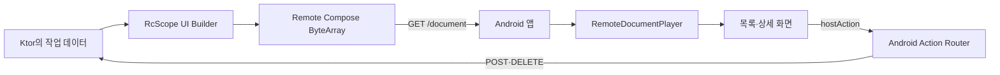

안녕하세요. 요즘 모바일 개발의 한계를 조금씩 느끼고 있는 Android 개발자로서, 이를 넘어설 만한 새로운 기술이 눈에 들어와 오랜만에 Android 주제로 글을 쓰게 되었습니다.

앱 화면의 문구나 구성 순서를 오늘 바꾸고 싶어도 네이티브 앱에서는 빌드와 검증, 스토어 심사, 사용자의 업데이트까지 기다려야 합니다. 빠른 실험이 필요한 기획·비즈니스 영역에서 WebView를 선택하는 이유도 이해가 되죠.

Android 개발자로서는 조금 아쉬웠습니다. 네이티브 앱의 장점을 유지하면서도 웹처럼 짧은 피드백 주기를 만들 수는 없을까 고민하게 되더라고요.

그 과정에서 SDUI(Server-Driven UI)와 이를 Android에서 구현할 수 있는 **Remote Compose**를 발견했습니다. 앱을 다시 배포하지 않고 서버에서 화면 구성을 바꾸고, 문서 안에서 상태와 사용자 동작까지 표현할 수 있는 AndroidX 라이브러리입니다. 저에게는 SDUI를 공부하면서 Ktor 서버까지 직접 만들어 볼 수 있다는 점도 매력적이었습니다.

이번에 간단한 체크리스트 앱으로 [Remote-Compose POC](https://github.com/kez-lab/Remote-Compose)를 만들었습니다. Ktor/JVM 서버가 현재 작업 목록으로 UI 문서를 생성하고, Android 앱이 문서를 내려받아 화면으로 그리는 구조입니다.

Remote Compose를 처음 접한 분도 전체 흐름을 빠르게 이해할 수 있도록, SDUI의 개념부터 실제 코드와 POC에서 확인한 한계까지 차례대로 살펴보겠습니다.

---

## 모바일 앱의 빠른 변경을 가로막는 배포 주기

일반적인 Android 앱에서는 화면의 구조가 APK나 App Bundle 안에 컴파일됩니다. 서버가 새로운 데이터를 보내더라도 그 데이터를 어떤 `Composable`로 보여 줄지는 앱 코드가 결정하죠.

텍스트나 이미지 URL 정도는 서버 응답으로 바꿀 수 있습니다. 하지만 카드의 순서를 바꾸거나 새로운 버튼을 추가하고, 클릭했을 때 다른 화면을 보여 주려면 앱 업데이트가 필요한 경우가 많습니다.

```text
기획 변경
  → Android 코드 수정
  → 빌드와 QA
  → 스토어 심사와 배포
  → 사용자 업데이트
```

안정성이 중요한 앱에서는 당연히 필요한 과정입니다. 문제는 작은 UI 실험도 같은 배포 주기를 따라야 한다는 점입니다.

SDUI는 이 과정에서 **화면을 구성하는 규칙의 일부를 서버로 옮기는 방식**입니다.

---

## SDUI는 화면 설계 일부를 서버로 옮긴다

SDUI(Server-Driven UI)는 서버가 데이터만 보내는 대신, 어떤 컴포넌트를 어떤 순서로 보여 줄지 설명하는 UI 문서까지 내려주는 구조입니다. Android 앱에는 그 문서를 읽을 수 있는 renderer가 들어갑니다.

| 구분 | 일반적인 Native UI | SDUI |
| --- | --- | --- |
| 서버가 전달하는 것 | 화면에 표시할 데이터 | 데이터와 UI 구성 문서 |
| 화면 구조를 결정하는 곳 | 앱에 컴파일된 코드 | 서버 문서와 앱 renderer |
| UI 구조 변경 | 앱 배포가 필요한 경우가 많음 | 지원 범위 안에서는 문서 배포로 가능 |
| 앱의 역할 | 화면과 동작을 직접 구현 | 문서를 검증하고 허용된 컴포넌트로 렌더링 |

서버가 Android 코드를 마음대로 실행하는 구조는 아닙니다. 앱이 미리 지원하는 컴포넌트와 action 안에서만 화면을 조립할 수 있습니다. 서버가 `Text`, `Row`, `Button` 같은 요소를 요청하더라도 이를 실제 Android UI로 만드는 주체는 앱의 renderer입니다.

이 제한 덕분에 앱은 화면 변경 속도를 높이면서도 Navigation, 권한, 인증, 결제 같은 핵심 기능의 통제권을 유지할 수 있습니다.

---

## Remote Compose는 UI를 바이너리 문서로 재생한다

Remote Compose는 SDUI의 문서와 renderer 역할을 AndroidX에서 제공하려는 프레임워크입니다. Compose와 유사한 API로 UI를 작성하면 라이브러리가 레이아웃·텍스트·상태·클릭 같은 작은 명령(operation)을 **바이너리 UI 문서**로 기록하고, Android의 Player가 문서를 읽어 화면을 그립니다.

처음에는 아래 세 가지 용어만 기억하면 이해하기 쉽습니다.

- **Builder**: Compose와 유사한 DSL로 UI operation을 문서에 기록
- **Document**: 레이아웃, 텍스트, 상태, action이 담긴 `ByteArray`
- **Player**: Android에서 문서를 해석하고 실제 화면으로 렌더링

이번 POC의 전체 흐름은 다음과 같습니다.



서버에서 작성한 DSL이 Android에서 다시 Kotlin 코드로 실행되는 것은 아닙니다. 서버는 UI operation이 담긴 ByteArray를 만들고, Player는 미리 정의된 operation만 해석합니다.

AndroidX에는 `@RemoteComposable` 콘텐츠를 capture하는 공개 생성 API도 있습니다. 이번 POC는 Ktor/JVM 서버에서 `RcScope`와 `createRcBuffer`를 사용하는 procedural 경로를 선택했습니다. 두 생성 방식은 API와 실행 환경이 다르므로 이 글에서는 서버 중심 경로만 다룹니다.

> POC는 `1.0.0-alpha14`에 고정되어 있습니다. 이 버전에서 사용한 JVM Builder와 embedded Player 진입점은 `LIBRARY_GROUP` restricted API, 즉 일반 앱을 위한 공개 API로 지원을 보장한 상태가 아니었습니다. 2026년 7월 30일 현재 공식 최신 버전은 `1.0.0-alpha16`이며 stable·beta 버전은 없습니다. 아래 코드는 제품용 권장 예제보다 alpha API의 동작을 확인한 학습용 코드에 가깝습니다.

---

## 이번 POC에서 만든 체크리스트

샘플은 서버에 저장된 작업을 목록과 상세 화면으로 보여 주는 간단한 앱입니다.

<p align="center">
  
  
  
</p>

앱을 실행하면 먼저 네이티브 Compose로 만든 서버 연결 화면이 나옵니다. 연결에 성공하면 Ktor 서버가 생성한 Remote Compose 문서를 받아 체크리스트를 표시합니다.

```text
네이티브 서버 연결 화면
  → GET /document
  → Remote Compose 작업 목록
      ├─ 행 선택 → 문서 내부 상세 화면
      ├─ 새 작업 → 네이티브 TextField → POST /tasks
      └─ 삭제 → DELETE /tasks/{id}
  → 작업 변경 성공
  → GET /document로 최신 화면 갱신
```

POC에서 확인한 동작은 다음과 같습니다.

- Ktor 서버의 현재 데이터로 목록 문서 생성
- Android에서 binary document 다운로드와 파싱
- Remote Compose Player의 목록·상세 화면 렌더링
- 12개 작업 목록의 세로 스크롤
- 문서 내부 상태를 이용한 목록·상세 전환
- Native 입력창에서 작업 생성
- 작업 추가·삭제 후 최신 문서 자동 갱신

이제 이 화면이 코드에서 어떻게 만들어지는지 세 단계로 나눠 보겠습니다.

---

## 1단계: Ktor에서 UI 문서 만들기

Ktor 서버는 `TaskStore`의 현재 데이터를 읽고, `/document` 요청이 들어올 때마다 새로운 Remote Compose 문서를 만듭니다.

아래 코드는 UI 세부 구현을 생략하고 문서 구조만 남긴 축약 예제입니다.

```kotlin
fun buildChecklistDocument(
    snapshot: ChecklistServerSnapshot,
): ByteArray = createRcBuffer(
    rcProfile,
    RemoteComposeWriter.HTag(Header.DOC_WIDTH, DOCUMENT_WIDTH),
    RemoteComposeWriter.HTag(Header.DOC_HEIGHT, DOCUMENT_HEIGHT),
) {
    val screen = remoteNamedInteger("screen", 0)

    StateLayout(
        stateIndex = screen,
        modifier = Modifier.fillMaxSize(),
    ) {
        TaskListScreen(snapshot, screen)

        snapshot.tasks.forEach { task ->
            TaskDetailScreen(snapshot, task, screen)
        }
    }
}
```

`createRcBuffer` 블록 안에서 `Text`, `Row`, `Column`, `StateLayout` 같은 UI operation을 기록합니다. 함수의 반환값은 Android `View`나 `@Composable`이 아니라 `ByteArray`입니다.

`screen`은 Player가 관리할 정수 상태입니다.

- `0`: 작업 목록
- `1..N`: 각 작업의 상세 화면

목록의 행을 누르면 `screen`을 해당 상세 화면 번호로 바꾸고, 상세 화면의 뒤로가기를 누르면 다시 `0`으로 변경합니다. 이 전환에는 새로운 네트워크 요청이 필요하지 않습니다.

---

## 2단계: UI 문서를 ByteArray로 전달하기

Ktor의 `/document` endpoint는 방금 만든 ByteArray를 그대로 응답합니다.

```kotlin
get("/document") {
    call.respondBytes(
        bytes = buildChecklistDocument(taskStore.snapshot()),
        contentType = ContentType.Application.OctetStream,
        status = HttpStatusCode.OK,
    )
}
```

JSON 응답을 DTO로 변환하는 일반적인 API와 달리, 이 endpoint는 Player가 읽을 수 있는 binary document를 전달합니다.

Android 앱은 응답 크기와 HTTP 상태를 확인한 뒤 `RemoteDocument`로 파싱합니다. POC에서는 지나치게 큰 문서를 받지 않도록 최대 크기를 512 KiB로 제한했습니다.

```kotlin
val response = client.get("$serverUrl/document")
val bytes = response.bodyAsBytes()

check(bytes.isNotEmpty())
check(bytes.size <= 512 * 1024)

val remoteDocument = RemoteDocument(bytes)
```

문서를 받았다고 곧바로 안전한 화면이 되는 것은 아닙니다. 실제 제품에서는 문서 버전, 허용 operation, 이미지 크기, 만료 시간까지 검증해야 합니다.

---

## 3단계: Android Player로 화면 그리기

검증과 파싱이 끝난 문서는 `RemoteDocumentPlayer`에 전달합니다.

```kotlin
RemoteDocumentPlayer(
    document = document,
    documentWidth = 390,
    documentHeight = 720,
    onNamedAction = { name, value, _ ->
        onHostAction(name, value)
    },
)
```

Player는 문서에 기록된 layout, text, state, click operation을 Android 화면에서 평가합니다. 서버가 내려준 목록의 개수가 달라지면 다음 `/document` 응답의 문서 내용도 달라지고, 앱은 새 문서를 Player에 전달해 화면을 갱신합니다.

이 구조에서 Android 앱은 수동으로 목록용 `LazyColumn`이나 상세 `Composable`을 만들지 않습니다. 대신 Player를 담을 화면과 문서 다운로드, 오류 처리, Native 기능 연결을 담당합니다.

---

## 상태는 수명에 따라 나누어 관리한다

Remote Compose가 상태를 지원한다고 해서 앱의 모든 상태를 문서에 넣는 것은 적절하지 않습니다. 상태가 유지되어야 하는 시간과 실제 데이터를 소유한 위치가 서로 다르기 때문입니다.

이번 POC에서는 상태를 네 곳으로 나눴습니다.

| 상태 | 소유자 | POC에서의 예 |
| --- | --- | --- |
| 연결 상태 | Android ViewModel | 서버 URL, loading, error, document bytes |
| 화면 상태 | Remote Compose Player | 현재 목록·상세 화면, 스크롤 위치 |
| 입력 상태 | 네이티브 Compose | TextField 초안, dialog, validation |
| 업무 데이터 | Ktor 서버 | task ID, 제목, document revision |

목록에서 상세 화면으로 이동하는 일은 Remote Compose의 `screen` 상태로 처리합니다. 사용자가 입력한 작업 제목과 서버에 저장된 task는 업무 데이터이므로 Android와 Ktor가 담당합니다.

이 구분은 문서를 갱신할 때 차이를 만듭니다. 새 문서가 Player에 전달되면 기존 문서의 화면 위치와 스크롤 상태는 초기값으로 돌아갈 수 있습니다. 반면 서버의 task는 그대로 남습니다.

편집 화면에 Remote Compose를 적용한다면 아래 항목을 먼저 정해야 합니다.

- 문서를 새로 받아도 입력 중인 내용이 남아야 하는가
- 화면 선택과 스크롤 위치를 복원해야 하는가
- 서버 데이터와 로컬 입력이 충돌하면 무엇을 우선하는가
- process death 뒤에는 어느 계층에서 상태를 복구할 것인가

SDUI의 상태 관리는 `remember`를 무엇으로 바꿀지보다, 각 상태의 소유자와 수명을 정하는 문제에 가깝습니다.

---

## hostAction으로 Android 기능 연결하기

Remote Compose 문서 안에서 처리할 수 있는 동작도 있지만, API 요청이나 Android Navigation처럼 앱의 도움이 필요한 기능도 있습니다. 이때 사용하는 연결 지점이 `hostAction`입니다.

작업 삭제 버튼은 문서에 아래와 같은 action을 기록합니다.

```kotlin
hostAction("task.delete.${task.id}")
```

사용자가 버튼을 누르면 Player가 action 이름을 Android callback으로 전달합니다.

```text
Remote 화면의 삭제 버튼
  → hostAction("task.delete.42")
  → RemoteDocumentPlayer.onNamedAction(...)
  → Android HostActionRouter
  → DeleteTask(42)
  → ViewModel
  → DELETE /tasks/42
  → 최신 문서 다시 받기
```

Android는 전달받은 문자열을 곧바로 API 주소나 Activity 이름으로 사용하지 않습니다. `HostActionRouter`가 앱에서 허용한 command인지 먼저 확인합니다.

```kotlin
fun commandFor(name: String): HostActionCommand? =
    when {
        name == "task.create" -> HostActionCommand.CreateTask

        name.startsWith("task.delete.") ->
            name.removePrefix("task.delete.")
                .toIntOrNull()
                ?.takeIf { it > 0 }
                ?.let(HostActionCommand::DeleteTask)

        else -> null
    }
```

서버 문서는 “42번 작업을 삭제하고 싶다”는 이름만 전달합니다. 어떤 endpoint를 호출할지, 현재 사용자에게 삭제 권한이 있는지, 실패하면 어떻게 재시도할지는 Android 앱이 결정합니다.

`hostAction`은 Remote UI와 Android 사이의 callback인 동시에 보안 경계입니다. 앱이 허용한 기능만 명시적인 command로 변환해야 원격 문서가 Native 기능을 무제한으로 호출하는 상황을 막을 수 있습니다.

---

## Remote UI와 네이티브 UI의 역할 나누기

POC의 `alpha14` procedural API에서는 일반적인 Android `TextField`처럼 키보드 입력을 받는 컴포넌트를 확인하지 못했습니다. 새 작업을 만드는 입력창은 네이티브 Compose dialog로 구현했습니다.

| Remote Compose가 담당한 영역 | 네이티브 Android가 담당한 영역 |
| --- | --- |
| 작업 목록과 행 | 서버 연결과 오류 화면 |
| 세로 스크롤 | TextField와 키보드 입력 |
| 작업 상세 화면 | 입력값 검증 |
| 목록·상세 전환 | Ktor API 요청 |
| create·delete action 전달 | 권한 확인과 action routing |

Remote Compose를 사용한다고 앱 전체를 Remote UI로 바꿀 필요는 없습니다. 서버가 자주 변경해야 하는 화면 구조는 Remote Compose에 두고, 플랫폼 기능과 복구 수단은 네이티브 화면에 남길 수 있습니다.

이런 혼합 구조는 기술의 부족함을 가리는 임시방편이라기보다 책임을 나누는 설계에 가깝습니다. 네트워크나 문서 파싱에 실패해도 사용자가 다시 연결할 수 있는 네이티브 화면은 앱 안에 남아 있어야 하니까요.

---

## POC를 만들며 만난 세 가지 난점

### 상태 변경과 화면 갱신을 따로 확인해야 했다

초기 실험에서는 버튼을 눌렀을 때 내부 정수 상태가 `3 → 4`로 바뀌었지만, 해당 값을 사용한 text와 일부 layout은 이전 표시를 유지했습니다.

그 뒤부터 테스트를 다음 단계로 나눴습니다.

1. 클릭 영역이 존재하는가
2. action이 실행됐는가
3. state 값이 변경됐는가
4. layout·text·semantics가 새 값을 표시하는가
5. 화면 이동과 문서 갱신 뒤에도 결과가 일관적인가

Compose 개발에서는 상태 변경과 recomposition을 자연스럽게 함께 생각합니다. Remote Compose에서는 Player가 문서의 operation과 state를 평가하므로, 값의 변경과 화면 반영을 별도로 확인하는 편이 안전했습니다.

### Density와 글자 크기는 실제 화면에서 검증해야 했다

procedural DSL의 `18.rsp`와 고정 크기를 Android Compose의 `18.sp`, `dp`와 비슷하게 사용했더니 글자와 간격의 비율이 맞지 않았습니다. POC에서는 Player의 density 값을 이용해 크기를 보정했습니다.

한 대의 Emulator에서 크기를 맞춘 것만으로 font scale 대응까지 끝난 것은 아닙니다. 여러 density, 큰 글꼴, 화면 크기에서 다시 확인해야 합니다.

### 목록 크기만큼 문서도 함께 커졌다

현재 POC는 task마다 목록 행과 상세 화면을 문서에 모두 기록합니다. 12개 작업의 스크롤은 확인했지만, `LazyColumn`처럼 화면에 보이는 항목만 만드는 구조는 아닙니다.

task가 늘어나면 payload와 operation 수도 함께 증가합니다. 대규모 목록을 다루려면 pagination이나 지원되는 lazy component를 확인하고, 문서 크기와 렌더링 시간에 제한을 둬야 합니다.

---

## 제품 도입 전에 필요한 준비

이번 POC에서 fetch, parse, render, 문서 내부 상태, host action까지는 확인했습니다. 실제 서비스에 적용하려면 화면을 그리는 기능보다 운영과 실패 대응을 더 많이 준비해야 합니다.

| POC에서 확인한 것 | 추가로 검증할 것 |
| --- | --- |
| Ktor의 binary document 전달 | producer와 Player의 버전 호환성 |
| 목록·상세·스크롤 렌더링 | 저사양 기기의 parse 시간과 memory |
| document-local 상태 변경 | process death와 상태 복원 |
| create·delete host action | 인증·인가, 중복 요청, 실행 기록 |
| 512 KiB 문서 크기 제한 | 형식이 깨진 문서와 과도한 CPU·메모리 사용 |
| 네이티브 오류 화면 | 마지막 정상 문서 보관과 이전 버전 복구 |
| Emulator UI 흐름 | TalkBack, 큰 글꼴, RTL, 다국어 |

Remote UI 문서가 깨지면 일부 텍스트만 틀리는 것으로 끝나지 않을 수 있습니다. 오류 화면이나 뒤로가기까지 문서에만 의존하면 사용자가 복구할 방법을 잃을 수 있죠.

그래서 새 문서를 검증한 뒤에만 현재 문서로 교체하고, 마지막으로 정상 동작한 문서와 네이티브 대체 화면을 함께 유지하는 구조가 필요합니다. 잘못 배포한 문서를 즉시 중단하는 kill switch와 이전 문서로 되돌리는 rollback도 앱 배포와 별도로 준비해야 합니다.

API 성숙도도 중요한 조건입니다. POC가 사용하는 `alpha14`의 procedural Builder와 Player는 restricted API에 의존합니다. 최신 alpha에서 API 공개 범위와 동작이 달라질 수 있으므로, 도입 전에는 공식 릴리스 노트와 실제 artifact를 다시 확인해야 합니다.

---

## Remote Compose를 처음 적용한다면

첫 실험부터 로그인, 결제, 주문처럼 실패 비용이 큰 화면을 옮길 필요는 없습니다. 서버에서 문구와 순서를 자주 바꾸고, 문제가 생겨도 네이티브 화면으로 돌아갈 수 있는 비핵심 화면이 더 적합합니다.

예를 들면 아래와 같은 화면입니다.

- 이벤트나 프로모션 안내
- 사용자의 진행 상태를 보여 주는 체크리스트
- 설정 도움말과 온보딩
- 운영 중 구성이 자주 바뀌는 정보 화면

저라면 같은 화면을 Remote Compose와 기존 Jetpack Compose로 각각 만들어 보겠습니다. 구현 코드의 길이보다 문서 크기, 첫 렌더링 시간, 상태 복원, 접근성, 잘못된 문서의 복구 비용을 비교하면 도입 가치가 더 명확해집니다.

Remote Compose는 네이티브 앱의 모든 화면을 서버로 옮기는 지름길이라기보다, Android 앱과 서버 사이에 **UI 문서라는 새로운 계약을 추가하는 기술**에 가깝습니다. 그 계약을 어디까지 허용하고 어떻게 실패시킬지 정하는 일이 화면 DSL을 작성하는 일보다 중요했습니다.

직접 코드를 따라가 보고 싶다면 [Remote Compose 서버 SDUI 코드랩](https://kez-lab.org/Remote-Compose/)에서 Ktor 문서 생성부터 Android Player까지 단계별로 확인할 수 있습니다.

---

## 참고 자료

- [Remote-Compose POC 저장소](https://github.com/kez-lab/Remote-Compose)
- [Remote Compose 공식 릴리스 노트](https://developer.android.com/jetpack/androidx/releases/compose-remote)
- [`@RemoteComposable` API 문서](https://developer.android.com/reference/kotlin/androidx/compose/remote/creation/compose/layout/RemoteComposable)
- [Remote Compose 서버 SDUI 코드랩](https://kez-lab.org/Remote-Compose/)
