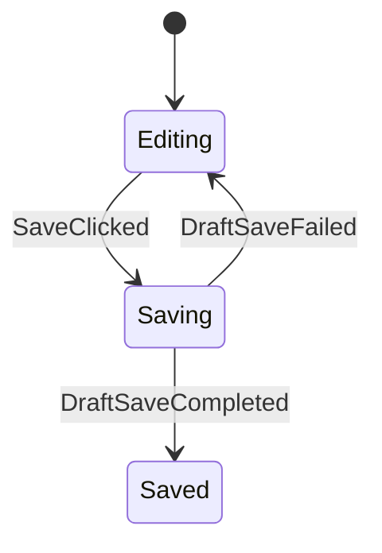
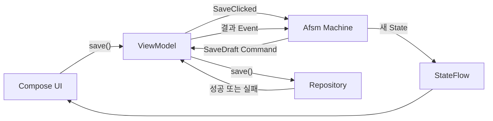

Android에서 화면 상태를 관리할 때 가장 먼저 떠올리는 건 역시 `ViewModel`과 `StateFlow`입니다.

처음에는 정말 단순하죠. 데이터를 불러오고, 로딩 상태를 보여주고, Repository의 결과를 UI State에 넣어주면 됩니다.

그런데 기능이 하나씩 추가되기 시작하면 문제가 생깁니다.

`isLoading`, `isSaving`, `isSaved`, `errorMessage`를 만들고 각각의 값을 따로 변경하다 보면, 어느 순간부터 지금 화면이 정확히 어떤 상태인지 Boolean 하나만 보고는 알 수 없게 됩니다.

저장 중인데 저장 완료 값도 `true`라면 어떻게 해야 할까요? 사용자가 저장 버튼을 두 번 눌렀는데 첫 번째 요청의 결과가 늦게 도착한다면요?

Boolean은 각각 정상인데, 같이 놓고 보니 말이 안 되는 상태가 만들어지는 것이죠.

이런 화면 흐름을 조금 더 명확하게 관리해보고 싶어서 Android에 맞춘 유한 상태 머신(Finite State Machine, FSM) 라이브러리 [Afsm](https://github.com/kez-lab/afsm)을 만들었습니다.

오늘은 Draft를 저장하는 작은 화면을 예제로 Afsm이 상태를 어떻게 나누는지, 그리고 `ViewModel`에는 어떤 코드가 남는지 설명해보겠습니다.

## ViewModel이 왜 복잡해졌을까?

먼저 흔히 작성할 수 있는 Draft 저장 코드를 잠깐 보시죠.

```kotlin
class DraftViewModel : ViewModel() {
    var isSaving by mutableStateOf(false)
    var isSaved by mutableStateOf(false)
    var errorMessage by mutableStateOf<String?>(null)

    fun save(title: String) {
        if (isSaving) return

        isSaving = true
        viewModelScope.launch {
            repository.save(title)
                .onSuccess {
                    isSaved = true
                }
                .onFailure { error ->
                    errorMessage = error.message
                }

            isSaving = false
        }
    }
}
```

현재 코드만 보면 크게 이상하지 않습니다. `isSaving`으로 중복 저장도 막고, 성공과 실패도 각각 처리하고 있으니까요.

하지만 재시도 기능을 추가하고, 저장이 끝난 뒤 화면 이동도 해야 하고, 이전 요청의 결과도 구분해야 한다면 어떻게 될까요?

각 coroutine 안에서 Boolean을 변경하는 코드가 늘어나고, 개발자는 아래와 같은 규칙을 직접 기억해야 합니다.

- 저장 중에는 다시 저장할 수 없다.
- 저장에 성공하면 `isSaving`은 `false`여야 한다.
- 실패 메시지는 다시 입력을 시작할 때 지워야 한다.
- 이미 완료된 요청의 결과는 다시 처리하면 안 된다.

문제는 이 규칙들이 타입이나 코드 구조에 드러나지 않는다는 점입니다. 결국 여러 함수에 흩어진 `if`와 Boolean 변경 코드를 모두 읽어야 전체 흐름을 알 수 있습니다.

## Afsm이란?

Afsm은 Android 화면의 비즈니스 흐름을 상태, 이벤트, 전이 규칙으로 표현하는 Kotlin 상태 머신 라이브러리입니다.

쉽게 얘기해서 화면이 가질 수 있는 단계를 미리 정하고, 현재 단계에서 어떤 이벤트를 받을 수 있는지 코드로 작성하는 방식입니다.

Draft 화면에는 세 단계만 있다고 가정해보겠습니다.



`Editing`은 제목을 입력하는 단계, `Saving`은 저장 중인 단계, `Saved`는 저장을 마친 단계입니다.

이 구조에서는 `Saving`과 `Saved`가 동시에 존재할 수 없습니다. 현재 Phase는 언제나 하나이기 때문입니다.

그렇다면 저장 버튼을 눌렀다는 정보와 Repository를 호출하라는 요청은 어디에 넣어야 할까요?

## State, Event, Command

Afsm은 화면 흐름을 `State`, `Event`, `Command`로 나눕니다.

| 타입 | 의미 | Draft 예제 |
| --- | --- | --- |
| `State` | 화면의 현재 단계와 유지할 데이터 | `Editing`, 입력한 제목 |
| `Event` | 사용자나 외부 작업에서 이미 발생한 일 | 저장 클릭, 저장 성공, 저장 실패 |
| `Command` | 머신이 외부에 요청할 작업 | Repository에 Draft 저장 |

여기서 Event와 Command가 조금 헷갈릴 수 있습니다.

사용자가 저장 버튼을 눌렀다는 건 이미 발생한 일이므로 Event입니다. Repository의 저장 결과가 도착한 것도 이미 발생한 일이기 때문에 Event가 됩니다.

반대로 Repository를 호출하는 작업은 앞으로 실행해야 합니다. 이때 머신은 `SaveDraft` Command를 만들고, Android 쪽에 실행을 요청합니다.

전체 흐름은 다음과 같습니다.



한 바퀴를 돌아 다시 머신으로 들어오죠.

굳이 이렇게 나눈 이유는 머신이 Repository나 Android 생명주기를 몰라도 같은 State와 Event를 받아 다음 결과를 계산하도록 만들기 위해서입니다.

## 상태부터 만들어보자

먼저 화면의 단계인 Phase를 정의합니다.

```kotlin
sealed interface DraftPhase {
    data object Editing : DraftPhase
    data object Saving : DraftPhase
    data object Saved : DraftPhase
}
```

제목과 오류 메시지는 Phase가 변경되어도 유지되어야 하므로 별도의 Data로 둡니다.

```kotlin
data class DraftData(
    val title: String = "",
    val errorMessage: String? = null,
)

typealias DraftState = AfsmState<DraftPhase, DraftData>
```

Phase와 Data를 나눈 이유는 화면의 단계와 화면이 들고 있는 값을 구분하기 위해서입니다.

예를 들어 `Editing`에서 `Saving`으로 이동해도 사용자가 입력한 제목은 그대로 필요합니다. 반면 현재 저장 중인지 확인할 때는 Boolean을 따로 찾지 않고 Phase만 보면 됩니다.

그렇다고 화면의 모든 값을 `DraftData`에 넣을 필요는 없습니다.

포커스, 스크롤 위치, `SnackbarHostState`처럼 UI에서만 필요한 값은 Compose에 두는 편이 자연스럽습니다. Afsm State에는 화면의 비즈니스 흐름을 결정하는 값만 넣습니다.

## Event와 Command 만들기

이제 머신으로 들어올 Event를 정의해보겠습니다.

```kotlin
sealed interface DraftEvent {
    data class TitleChanged(val value: String) : DraftEvent
    data object SaveClicked : DraftEvent
    data object DraftSaveCompleted : DraftEvent
    data class DraftSaveFailed(val message: String) : DraftEvent
}
```

Repository에 요청할 작업은 Command로 만듭니다.

```kotlin
sealed interface DraftCommand {
    data class SaveDraft(val title: String) : DraftCommand
}
```

`SaveClicked` 안에서 Repository를 바로 호출하면 안 되냐고 생각하실 수 있습니다.

물론 일반 `ViewModel`에서는 그렇게 작성해도 됩니다. 하지만 Afsm의 머신 안에서 suspend 함수를 호출하면 상태 전이 규칙이 coroutine과 Android 실행 환경에 묶입니다.

저는 머신만 떼어놓고도 `현재 상태 + 이벤트 = 다음 상태와 작업`을 바로 확인할 수 있기를 원했습니다. 그래서 외부 작업은 Command로 분리했습니다.

## 전이 규칙 구현

타입을 만들었으니 이제 실제 화면 흐름을 작성해보겠습니다.

```kotlin
val draftMachine: AfsmDefaultMachine<
    DraftState,
    DraftEvent,
    DraftCommand,
> = afsmMachine {
    initial(
        phase = DraftPhase.Editing,
        data = DraftData(),
    )

    phase(DraftPhase.Editing) {
        on<DraftEvent.TitleChanged> {
            updateData { data, event ->
                data.copy(
                    title = event.value,
                    errorMessage = null,
                )
            }
        }

        on<DraftEvent.SaveClicked> {
            case(
                label = "valid title",
                condition = { data.title.isNotBlank() },
            ) {
                transitionTo(DraftPhase.Saving)
            }

            case(
                label = "missing title",
                condition = { data.title.isBlank() },
            ) {
                updateData {
                    copy(errorMessage = "제목을 입력해주세요.")
                }
            }
        }
    }

    phase(DraftPhase.Saving) {
        onEnter {
            command(label = "SaveDraft") {
                DraftCommand.SaveDraft(data.title)
            }
        }

        on<DraftEvent.DraftSaveCompleted> {
            transitionTo(DraftPhase.Saved)
        }

        on<DraftEvent.DraftSaveFailed> {
            updateData { data, event ->
                data.copy(errorMessage = event.message)
            }
            transitionTo(DraftPhase.Editing)
        }
    }

    phase(DraftPhase.Saved)
}
```

코드가 조금 길어 보이지만 읽는 방법은 단순합니다.

현재 Phase를 찾고, 그 안에서 어떤 Event를 처리하는지 보면 됩니다.

`Editing`에서는 제목 변경과 저장 클릭을 처리합니다. 제목이 비어 있으면 오류 메시지만 변경하고, 제목이 있다면 `Saving`으로 이동합니다.

`Saving`에 진입하면 `SaveDraft` Command를 만듭니다. 이후 저장 성공 Event가 오면 `Saved`로 이동하고, 실패 Event가 오면 오류 메시지를 저장한 뒤 다시 `Editing`으로 돌아갑니다.

여기서 `case`는 왜 필요할까요?

같은 `SaveClicked` Event라도 제목이 있는 경우와 없는 경우의 결과가 다르기 때문입니다. 이 분기는 생성되는 상태 그래프에도 그대로 표시됩니다.

## Repository는 누가 호출하지?

머신은 `SaveDraft` Command만 만들었습니다. 실제 Repository 호출은 여전히 `ViewModel`이 담당합니다.

```kotlin
class DraftViewModel(
    private val repository: DraftRepository,
) : ViewModel() {

    private val host = afsmHost(
        machine = draftMachine,
        commandHandler = { command: DraftCommand, send ->
            when (command) {
                is DraftCommand.SaveDraft -> {
                    repository.save(command.title).fold(
                        onSuccess = {
                            send(DraftEvent.DraftSaveCompleted)
                        },
                        onFailure = { error ->
                            send(
                                DraftEvent.DraftSaveFailed(
                                    error.message ?: "저장에 실패했습니다.",
                                ),
                            )
                        },
                    )
                }
            }
        },
    )

    val state: StateFlow<DraftState> = host.state

    fun updateTitle(value: String) {
        host.send(DraftEvent.TitleChanged(value))
    }

    fun save() {
        host.send(DraftEvent.SaveClicked)
    }
}
```

Afsm을 사용한다고 `ViewModel`이 사라지는 건 아닙니다.

`ViewModel`은 `viewModelScope`에 맞춰 host의 생명주기를 관리하고, Repository를 호출하고, 작업 결과를 다시 Event로 보냅니다.

머신은 어떤 상태에서 어떤 작업이 필요한지 결정하고, `ViewModel`은 그 작업을 Android 환경에서 실제로 실행하는 것이죠.

Compose UI도 기존 방식과 크게 달라지지 않습니다.

```kotlin
@Composable
fun DraftRoute(
    viewModel: DraftViewModel,
) {
    val state by viewModel.state.collectAsStateWithLifecycle()

    DraftScreen(
        title = state.data.title,
        errorMessage = state.data.errorMessage,
        isSaving = state.phase == DraftPhase.Saving,
        onTitleChange = viewModel::updateTitle,
        onSave = viewModel::save,
    )
}
```

UI에는 `DraftEvent.SaveClicked` 같은 머신 타입을 직접 노출하지 않았습니다. `save()`, `updateTitle()`처럼 화면에서 하려는 동작을 바로 알 수 있는 메서드만 사용합니다.

Android 공식 아키텍처 가이드에서도 `ViewModel`이 관찰 가능한 UI State를 노출하고, UI의 Action을 메서드로 받는 단방향 데이터 흐름을 권장합니다. Afsm은 이 방식을 교체하지 않습니다. `ViewModel` 안에 흩어졌던 상태 전이 규칙을 별도의 머신으로 옮깁니다.

## 테스트는 어떻게 달라질까?

상태 머신을 분리하면 테스트 방식도 달라집니다.

Repository를 준비하거나 coroutine이 끝나기를 기다리지 않고, 원하는 State와 Event를 넣어 다음 상태를 바로 확인할 수 있습니다.

```kotlin
@Test
fun `유효한 Draft는 저장 단계와 Command를 만든다`() {
    val editing = DraftState(
        phase = DraftPhase.Editing,
        data = DraftData(title = "Afsm 글 초안"),
    )

    draftMachine
        .transition(editing, DraftEvent.SaveClicked)
        .assertTransitioned()
        .assertPhase(DraftPhase.Saving)
        .assertCommands(
            DraftCommand.SaveDraft("Afsm 글 초안"),
        )
}
```

이 테스트가 확인하는 건 Repository 저장 성공 여부가 아닙니다.

유효한 제목으로 저장 버튼을 눌렀을 때 `Saving`으로 이동하고, 정확한 제목을 가진 `SaveDraft` Command를 만드는지 확인합니다.

반대로 제목이 비어 있다면 어떻게 될까요?

```kotlin
@Test
fun `빈 제목은 저장 작업을 시작하지 않는다`() {
    val editing = DraftState(
        phase = DraftPhase.Editing,
        data = DraftData(title = ""),
    )

    draftMachine
        .transition(editing, DraftEvent.SaveClicked)
        .assertHandled()
        .assertPhase(DraftPhase.Editing)
        .assertNoCommands()
}
```

`Editing`을 유지하고 Command도 만들지 않아야 합니다.

비동기 작업을 실행한 뒤 결과 Event를 보내는 `ViewModel`은 별도의 coroutine 테스트에서 확인하면 됩니다. 전이 규칙과 외부 작업 테스트가 자연스럽게 나뉘는 셈입니다.

## 코드가 길어지면 그래프를 먼저 보자

Phase가 몇 개 없을 때는 머신 코드만 읽어도 흐름을 이해하기 쉽습니다.

하지만 결제나 인증처럼 Phase와 조건 분기가 많아지면 코드만 보고 전체 흐름을 그리기 어렵습니다. Afsm은 실행되는 머신 정의에서 Mermaid 상태 그래프를 생성합니다.

Draft 머신은 아래와 같이 보입니다.

```mermaid
stateDiagram-v2
    [*] --> Editing
    state Editing
    state Saving
    note right of Saving
        entry / SaveDraft
    end note
    state Saved
    Editing --> Saving: SaveClicked [valid title]
    Editing --> Editing: SaveClicked [missing title]
    Saving --> Saved: DraftSaveCompleted
    Saving --> Editing: DraftSaveFailed
```

그래프를 보면 전체 Phase와 분기가 한눈에 들어옵니다.

다만 그래프가 모든 코드를 보여주는 건 아닙니다. 제목이 어떻게 변경되는지, 오류 메시지를 언제 지우는지 같은 Data 규칙은 머신 코드와 테스트를 함께 봐야 합니다.

즉 그래프는 전체 흐름을 보고, 머신 코드는 상태 변경 내용을 보고, 테스트는 놓치면 안 되는 조건을 확인하는 용도입니다.

## 모든 화면에 Afsm을 써야 할까?

여기까지 읽으면 State, Event, Command로 나누는 쪽이 무조건 안전해 보일 수도 있습니다.

하지만 단순한 화면이라면 `ViewModel + StateFlow`만 사용하는 편이 더 좋습니다.

데이터를 불러와 `Loading`, `Content`, `Error` 중 하나를 보여주고 끝나는 화면에 상태 머신까지 넣으면 타입과 파일만 늘어날 수 있습니다.

Afsm은 다음과 같은 화면에서 검토해볼 만합니다.

- 현재 단계에 따라 허용되는 사용자 동작이 달라지는 화면
- 결제, 인증, 업로드처럼 실패와 재시도가 이어지는 화면
- 중복 실행을 막아야 하거나 이전 요청의 늦은 결과를 구분해야 하는 화면
- 잘못된 상태 조합이 실제 장애로 이어질 수 있는 화면

반대로 Phase를 그려봤는데 상태 서너 개와 단순한 화살표로 끝나고, 현재 `ViewModel`에서도 흐름이 잘 보인다면 굳이 바꿀 필요는 없습니다.

Draft 예제도 사실 Afsm이 꼭 필요한 복잡도는 아닙니다. 처음 보는 API를 설명하기 위해 가장 작은 흐름을 선택했습니다.

## 복원하면 Command도 다시 실행될까?

상태 머신을 사용한다고 Android의 상태 복원 문제가 자동으로 해결되지는 않습니다.

`SavedStateHandle`에서 어떤 값을 복원할지, 진행 중이던 외부 작업을 다시 실행해도 되는지는 기능마다 직접 정해야 합니다.

Afsm은 초기 State를 만들었다는 이유만으로 `onEnter`를 자동 실행하지 않습니다. 결제처럼 중복 실행 비용이 큰 작업이 화면 복원만으로 다시 시작되는 상황을 피하기 위해서입니다.

인증 완료나 결제 완료처럼 복원 뒤에도 의미가 남아야 하는 결과는 State로 표현합니다. 반면 다이얼로그 닫기처럼 UI 안에서 끝나는 동작은 UI callback으로 처리합니다.

Afsm에는 별도의 Effect 출력 타입을 두지 않았습니다. 모든 앱에서 Effect를 쓰면 안 된다는 뜻은 아닙니다. State, Event, Command와 역할이 겹치는 출력 타입을 라이브러리 기본 구조에 추가하지 않기로 한 설계입니다.

## 현재 Afsm은 배포 전입니다

Afsm은 아직 Maven Central에 배포하지 않았습니다.

[GitHub 저장소](https://github.com/kez-lab/afsm)와 [한글·영문 문서](https://kez-lab.org/afsm/)는 공개해두었지만, API는 pre-1.0 단계라 실제 사용성과 안전성을 확인하면서 변경될 수 있습니다. 배포가 끝나면 설치 방법도 함께 추가하겠습니다.

## Afsm을 만들면서 중요하게 본 것

처음에는 상태 값만 잘 다루면 복잡한 화면도 충분히 관리된다고 생각하기 쉽습니다. 저도 Afsm을 만들면서 타입을 많이 나누는 것보다 `누가 상태를 결정하고, 누가 외부 작업을 실행하는가`를 분명하게 만드는 쪽을 더 중요하게 봤습니다.

머신이 Repository까지 실행하면 테스트가 다시 coroutine과 Android 환경에 묶입니다. 반대로 `ViewModel`이 상태 전이까지 모두 결정하면 처음에 겪었던 복잡한 흐름으로 돌아가게 됩니다.

그래서 Afsm은 상태 전이와 외부 작업 사이에 Command를 두었습니다.

조금 돌아가는 것처럼 보이지만, 문제가 생겼을 때 머신을 볼지, `ViewModel`을 볼지 구분하기는 훨씬 쉬워집니다.

다음에는 Draft보다 조금 더 복잡한 Checkout 화면을 일반 `ViewModel`과 Afsm으로 각각 구현해보려고 합니다. 중복 결제와 늦게 도착한 응답, 프로세스 종료 후 복원까지 들어가면 상태 머신이 어디서 값을 하는지 더 확실하게 보일 것 같습니다.

지금 작업 중인 `ViewModel`을 한번 떠올려보세요.

절대로 함께 존재하면 안 되는 Boolean 조합이 바로 생각난다면, 그 화면은 Phase와 전이 규칙으로 한번 그려볼 만한 후보입니다.

## 참고 자료

- [Afsm GitHub 저장소](https://github.com/kez-lab/afsm)
- [Afsm 한글·영문 문서](https://kez-lab.org/afsm/)
- [Android 아키텍처 권장 사항](https://developer.android.com/topic/architecture/recommendations)
- [Android UI Event 가이드](https://developer.android.com/topic/architecture/ui-layer/events)
